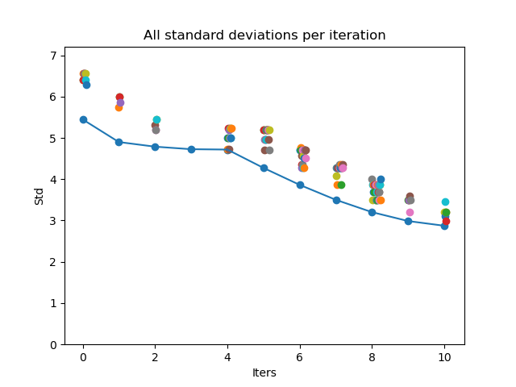

# Multilabel Oversampling :sunflower:

**Many algorithms for imbalanced data support binary and multiclass classification only.**
**This approach is made for multi-label classification (aka multi-target classification).**


## :slot_machine: Algorithm

* Multilabel dataset (as `pandas.DataFrame`) with imbalanced data
* Calculate counts per class and then calculate the standard deviation (std) of the count values
* Do for `number_of_adds` times the following: 
	* Randomly draw a sample from your data and calculate new std  
	* If new std reduces, add sample to your dataset
	* If not, draw another sample (to this up to `number_of_tries` times)
* A new df is returned. 
* A result plot visualizes the target distribution before and after upsampling. Moreover the counts per index are shown.

## :arrow_right: Usage

```python
import multilabel_oversampling as mo

mo.seed_everything(20)
df = mo.create_fake_data(size=1) # difficult fake dataset with very high dependency of y1 and y2
ml_oversampler = mo.MultilabelOversampler(number_of_adds=100, number_of_tries=100)
df_new = ml_oversampler.fit(df)
#>Start the upsampling process.
#>Iteration:  11%|████████████████                                        | 11/100 [00:00<00:01, 48.43it/s]
#>Iter 11: No improvement after 100 tries.
#>Sampling done.
#>
#>Dataset size original: 20; Upsampled dataset size: 31
#>Original target distribution:  {'y1': 16, 'y2': 12, 'y3': 4, 'y4': 4}
#>Upsampled target distribution: {'y1': 19, 'y2': 12, 'y3': 15, 'y4': 15}

ml_oversampler.plot_all_tries()
```


```python
ml_oversampler.plot_results()
```


```python
#import seaborn as sns
#df.style.background_gradient(cmap=sns.color_palette("Spectral", as_cmap=True))

# Original DataFrame
print(df)
#>    y1  y2  y3  y4           x
#>0    1   1   0   0   img_0.jpg
#>1    1   1   0   0   img_1.jpg
#>2    1   1   0   1   img_2.jpg
#>3    1   1   0   0   img_3.jpg
#>4    1   1   1   0   img_4.jpg
#>5    1   1   0   0   img_5.jpg
#>6    1   1   0   0   img_6.jpg
#>7    1   1   0   0   img_7.jpg
#>8    1   1   0   1   img_8.jpg
#>9    1   1   0   0   img_9.jpg
#>10   1   1   0   0  img_10.jpg
#>11   1   1   0   0  img_11.jpg
#>12   1   0   1   0  img_12.jpg
#>13   1   0   1   1  img_13.jpg
#>14   1   0   0   0  img_14.jpg
#>15   1   0   0   0  img_15.jpg
#>16   0   0   0   0  img_16.jpg
#>17   0   0   0   0  img_17.jpg
#>18   0   0   0   0  img_18.jpg
#>19   0   0   1   1  img_19.jpg


# New DataFrame after upsampling
print(df_new)
#>    y1  y2  y3  y4           x
#>0    1   1   0   0   img_0.jpg
#>1    1   1   0   0   img_1.jpg
#>2    1   1   0   1   img_2.jpg
#>3    1   1   0   0   img_3.jpg
#>4    1   1   1   0   img_4.jpg
#>5    1   1   0   0   img_5.jpg
#>6    1   1   0   0   img_6.jpg
#>7    1   1   0   0   img_7.jpg
#>8    1   1   0   1   img_8.jpg
#>9    1   1   0   0   img_9.jpg
#>10   1   1   0   0  img_10.jpg
#>11   1   1   0   0  img_11.jpg
#>12   1   0   1   0  img_12.jpg
#>13   1   0   1   1  img_13.jpg
#>14   1   0   0   0  img_14.jpg
#>15   1   0   0   0  img_15.jpg
#>16   0   0   0   0  img_16.jpg
#>17   0   0   0   0  img_17.jpg
#>18   0   0   0   0  img_18.jpg
#>19   0   0   1   1  img_19.jpg
#>19   0   0   1   1  img_19.jpg
#>19   0   0   1   1  img_19.jpg
#>13   1   0   1   1  img_13.jpg
#>13   1   0   1   1  img_13.jpg
#>13   1   0   1   1  img_13.jpg
#>19   0   0   1   1  img_19.jpg
#>19   0   0   1   1  img_19.jpg
#>19   0   0   1   1  img_19.jpg
#>19   0   0   1   1  img_19.jpg
#>19   0   0   1   1  img_19.jpg
#>19   0   0   1   1  img_19.jpg
```


## :information_source: Install

* Install from GitHub (you may need to install dependencies from `requirements.txt` first)

```bash
pip install git+https://github.com/phiyodr/multilabel-oversampling
```


## :construction_worker: Future work

* [ ] Implement weighted sampling (so that samples which are already often in the new df are less often sampled)

:sunflower:
