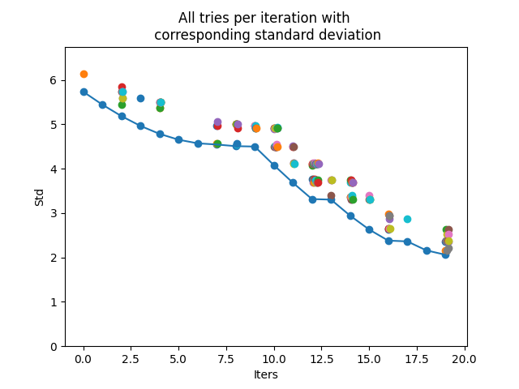
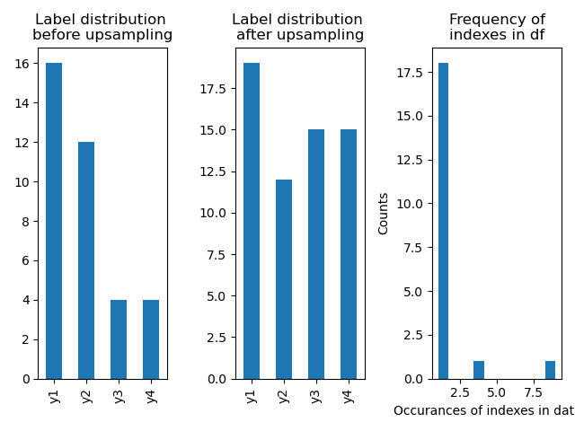

# Multilabel Oversampling

**Many algorithms for imbalanced data support binary and multiclass classification only.**
**This approach is made for mulit-label classification (aka multi-target classification).**


## :slot_machine: Algorithm

* Multilabel dataset (as `pandas.DataFrame`) with imbalanced data
* Calculate counts per class and then calculate the standard deviation (std) of the count values
* Do for `number_of_adds` times the following: 
* Randomly draw a sample from your data and calculate new std  
	* If new std reduces, add sample to your dataset
	* If not, draw another sample (to this up to `number_of_tries` times)
* A new df is returned. 
* A result plot viszualize the target distribition before and after upsampling. Moreover the counts per index are shown. 

## :arrow_right: Usage

```python
from multilabel_oversampling import multilabel_oversampling as mo

df = mo.create_fake_data(size=1, seed=3)
ml_oversampler = mo.MultilabelOversampler(number_of_adds=100, number_of_tries=100)
df_new = ml_oversampler.fit(df)
#> Iteration:  20%|██████                        | 20/100 [00:00<00:00, 111.68it/s]
#> No improvement after 100 tries in iter 20.
```


```python
ml_oversampler.plot_results()
```



## :information_source: Install

* Install from GitHub

```bash
pip install git+https://github.com/phiyodr/multilabel-oversampling
```

:sunflower: